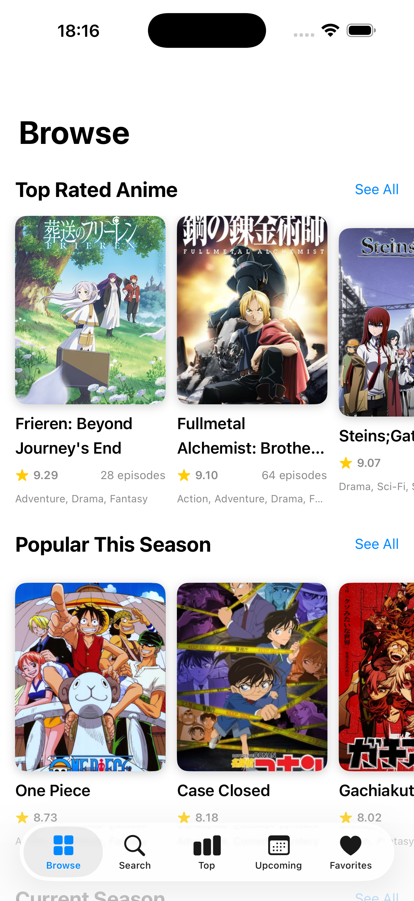
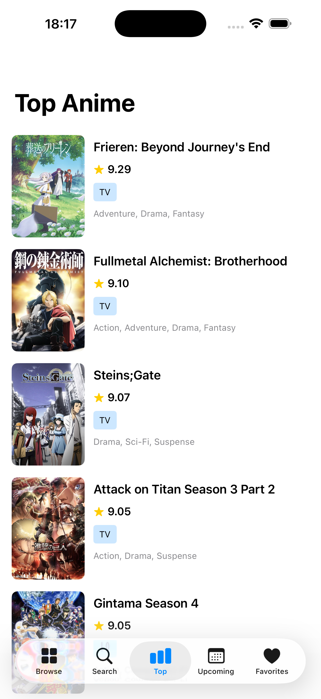
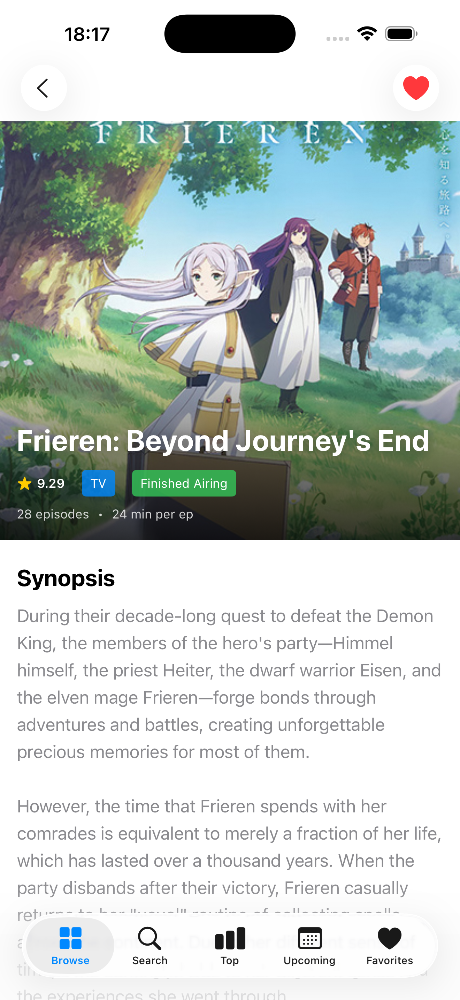

# Anime Explorer

An iOS application for exploring anime using the Jikan API. Built with SwiftUI, this app provides real-time anime search, browsing by categories, detailed information pages, and a favorites system with local persistence.

## Features

### Core Functionality

- Real-time search for anime titles with debouncing
- Browse anime by categories (Top Rated, Popular, Seasonal, Upcoming)
- View detailed anime information including synopsis, rating, episodes, genres, and characters
- Add anime to favorites with Core Data persistence
- View character information for each anime
- Discover anime recommendations
- Pull-to-refresh functionality
- Infinite scroll with pagination

### Technical Features

- Dark mode support
- Image caching (memory and disk) for improved performance
- API rate limiting (0.5 second delay between requests)
- Comprehensive error handling with retry options
- Smooth animations and loading states
- MVVM architecture pattern

## Architecture

The app follows the Model-View-ViewModel (MVVM) architecture pattern:

```text
Anime Explorer/
├── Models/                        # Data structures
│   ├── Anime.swift
│   ├── AnimeImages.swift
│   ├── AnimeResponse.swift
│   ├── Character.swift
│   ├── Pagination.swift
│   └── Recommendation.swift
├── ViewModels/                    # Business logic and state management
│   └── AnimeViewModel.swift
├── Views/                         # UI components
│   ├── MainTabView.swift
│   ├── BrowseView.swift
│   ├── SearchView.swift
│   ├── AnimeListView.swift
│   ├── AnimeDetailView.swift
│   ├── FavoritesView.swift
│   └── Components/
│       ├── AnimeCardView.swift
│       └── AsyncImageView.swift
├── Services/                      # API and caching
│   ├── APIService.swift
│   ├── APIError.swift
│   └── ImageCache.swift
└── Persistence.swift              # Core Data management
```

## API Integration

Uses Jikan API v4 ([https://api.jikan.moe/v4](https://api.jikan.moe/v4)), an unofficial MyAnimeList API.

### Endpoints

- `/anime` - Search anime
- `/top/anime` - Top rated anime
- `/seasons/{year}/{season}` - Seas# onal anime
- `/seasons/upcoming` - Upcoming anime
- `/anime/{id}` - Anime details
- `/anime/{id}/characters` - Anime characters
- `/anime/{id}/recommendations` - Anime recommendations

### Screenshots

| Browse View | Top Anime View | Anime Detail View |
|-------------|-------------|-------------------|
|  |  |  |
